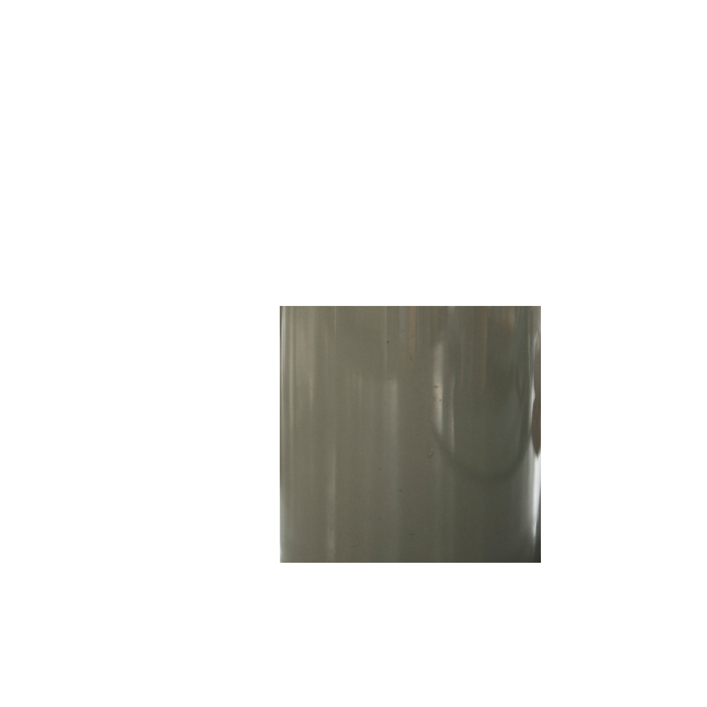

# CLIPMOCK

#### Video Demo: <URL HERE>

#### Description:

Clipmock is a web application to generate desgin mockups, it has 3 sections, apparel, business cards and objects, in each of the sections you either upload your design or enter some text details and click create for the mockup to be generated. There's an option to remove background of your design before creating the mockups in the apparel and objects sections.

#### Method:

**Terms used**:
_mockup-image_ - images on which the design will be pasted/blended

_subject-image_ - part of the mockup image beyond which the design shouldn't extend, this is where we paste/blend the design

_background-image_ - the part of the mockup image without the subject part (it is cut out or transparent)

In the static directory, we have before, subjects, background, before, after directories. The before directory contains the mockup-image(s), subjects directory contains the subject_image(s) and the backgrounds directory contains background-image(s).

The mockups are generated by mockup() in helpers.py according to attributes specified in constants.py, any changes to position or the size of design can be made in constants.py

the mockup function first fetches the corresponding subject-image and blends the desgin onto it, then the corresponding background image is pasted on top of this. This method makes sure the design absolutely doesn't extend the the subject-image and also allows for some kind of overlay like the model's hands or hoodie strings on the design if the mockup-image has any of those.
The resulting image is the final mockup which is saved in after directory.

#### Files:

- templates/
  contains html files for respective pages.

-static/
-before/
contains raw mockup-images
-subjects/
contains subject-images
-backgrounds/
contains background-images
-after/
contains final generated mockups
-fonts/
contains ttf font files used for business cards
-index/
conains images used in index page for animation
-script/
contains javascript files for respective templates, script.js is common for all templates.
-style/
contains single css file common for all templates.

-collection.zip
zip file that is written to and finally sent when user the downloads their collection.

-\_\_init\_\_.py
initialization file for the package, contains app and db initialization

-constants.py
1.APPAREL - {
base-img-name : [max size of design in px , position to be pasted - (x, y)]
}
base-img-name is the name with which the corresponding images stored in before, after, subjects, background directories

2.OBJECTS - same as APPAREL

3.BCARDS - {
form-element : [position to pasted (x, y), fill color (R, G, B, A), font weight (H for heavy and T for thin)]
}
_exception:_
qrcode : [position to pasted(x, y)]
_note:_
Since each business card has two corresponding images 'less' and 'more':
if form-element starts with less\_ it means it should be drawn in 'less' image or flip side of the business card, here 'less' indicates the side of the card with less details
else the form-element should be draw in 'more' image.

-helpers.py
contains helper functions which are used in routes.py
1.responsive_font - to scale the text as per its length in business cards so it doesn't overflow the perimeter
2.get_dominant_color - used in mockup to apply appropriate blend mode
3.mockup (for apparel and objects) - to blend design into the mockup image with attributes provided in constants.py

-models.py
contains sqlalchemy db models

-routes.py
contains functions binded to URL routes

-run.py
file used to run the app (python run.py)
